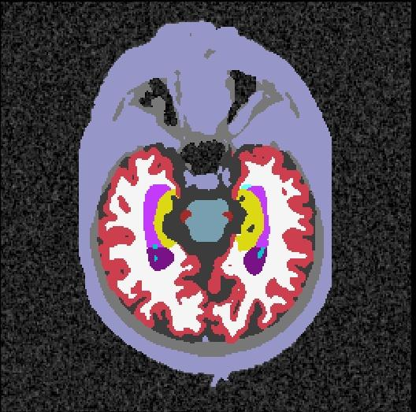
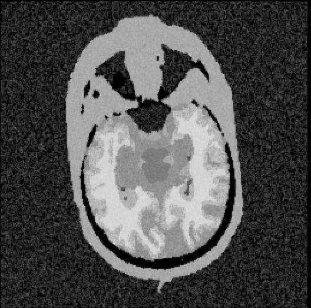
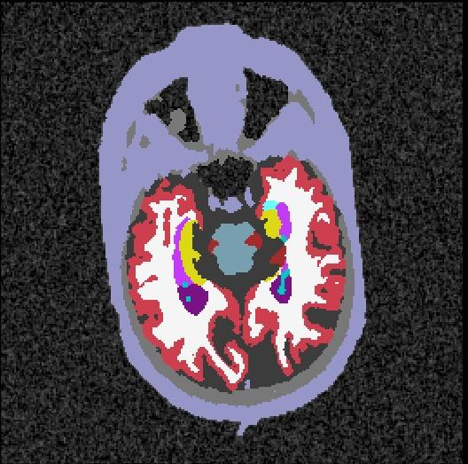

lab2im Generation with Skull
============================

`lab2im` can generate images based on an image with a skull provided the
skull segments are properly labeled. 

lab2im example
--------------

### Input image

Consider the brain label map data example below:

We can see that the image has the following labels outside of the brain:

* Skull (165) grayish
* Head Extra-Cerebral (258) violet
* some unlabeled cavities

### Output images

This is the T1-w generated image:

We can see that the skull is present.

Here is the generated label map:

The Skull and Head Extra-Cerebral locations are present and labeled correctly.

However, **if the skull is not present and labeled in the input label map**,
then it will not be present in the generated images (with labels and without
labels).  (How could it be?)
