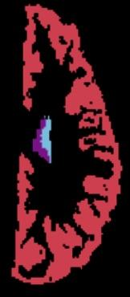

lab2im Image Generation
=======================

An example of `lab2im` generation can be given by running
[t1w_generation.py](https://github.com/BBillot/lab2im/blob/master/tutorials/t1w_generation.py).
I am using the default parameters.  The nature of the images generated is customizable.

As input, we use the labelling (8mo_Template01.nii.gz) below:

The input file is available here:

* /home/feczk001/shared/data/nnUNet/nnUNet_raw_data_base/nnUNet_raw_data/Task500_Babies8Mo/labelsTr/8mo_Template01.nii.gz

`lab2im` generates 5 sets of output files:

T1w       |  labels
:-------------------------:|:-------------------------:
  |  
  |  
  |  
  |  
  |  

The output files are available here:

* /home/feczk001/shared/data/nnUNet/lab2im_generated_images/